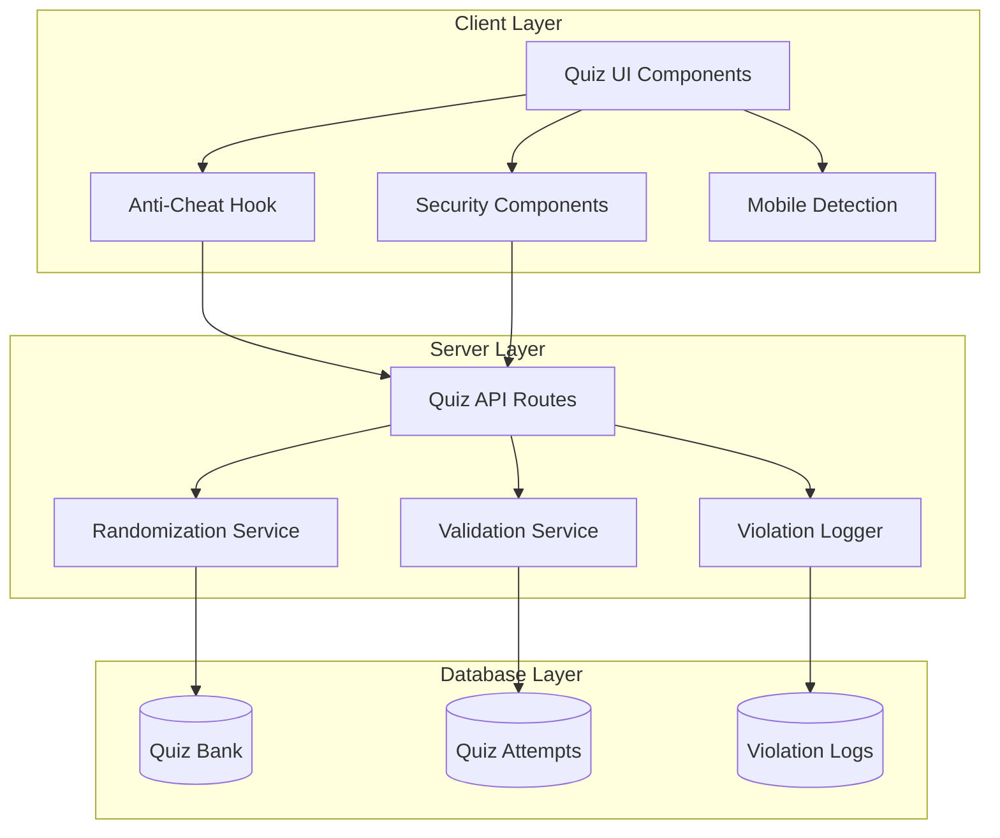

# Design Document

## Overview

This design document outlines the architecture and implementation strategy for enhancing the quiz platform's anti-cheating capabilities and question randomization features. The solution builds upon the existing anti-cheat infrastructure while adding server-side randomization, improved copy/paste prevention, context menu blocking, and mobile-responsive security measures. The design ensures quiz integrity across all device types while maintaining excellent user experience and performance.

## Architecture

### High-Level Architecture



### Component Interaction Flow

```mermaid
sequenceDiagram
    participant S as Student
    participant C as Client
    participant API as Server API
    participant DB as Database
    
    S->>C: Start Quiz
    C->>API: Request Quiz (quizId)
    API->>DB: Fetch Quiz
    API->>API: Randomize Questions
    API->>API: Randomize Answer Options
    API->>DB: Store Randomization Mapping
    API->>C: Return Shuffled Quiz
    C->>C: Initialize Anti-Cheat
    C->>C: Enable Security Features
    
    loop During Quiz
        C->>C: Monitor Violations
        alt Violation Detected
            C->>API: Log Violation
            API->>DB: Store Violation Record
            C->>S: Show Warning
        end
    end
    
    S->>C: Submit Quiz
    C->>API: Submit Answers
    API->>DB: Fetch Randomization Mapping
    API->>API: Validate Against Original Positions
    API