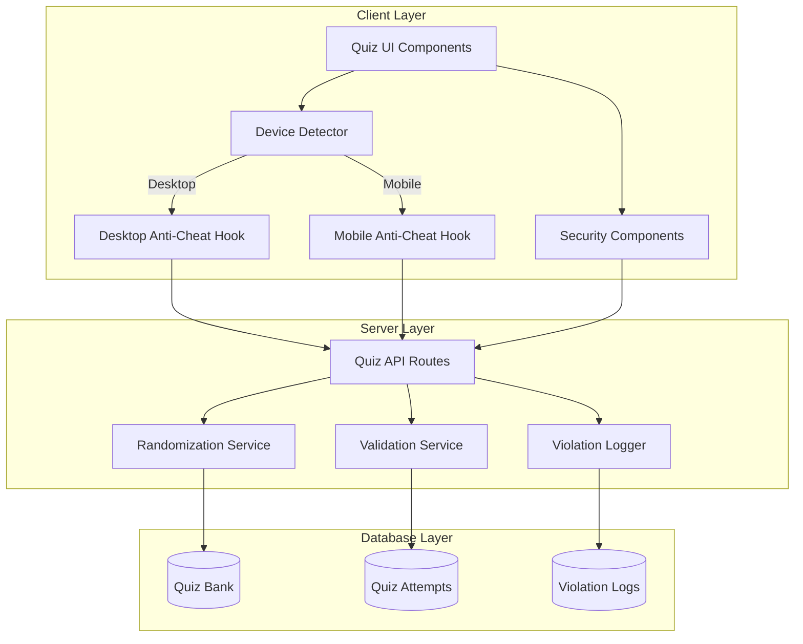
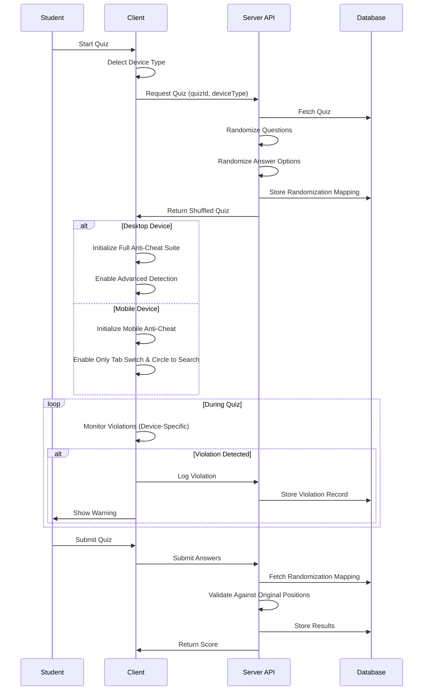

# Design Document

## Overview

This design document outlines the architecture and implementation strategy for enhancing the quiz platform's anti-cheating capabilities and question randomization features. The solution builds upon the existing anti-cheat infrastructure while adding server-side randomization, improved copy/paste prevention, context menu blocking, and device-specific security measures. The design ensures quiz integrity across all device types while maintaining excellent user experience and performance, with simplified mobile detection to prevent false positives.

## Architecture

### High-Level Architecture



### Component Interaction Flow



## Components and Interfaces

### 1. Device Detection Module

**Purpose**: Accurately identify device type to apply appropriate anti-cheat measures.

**Interface**:
```typescript
interface DeviceDetector {
  isMobile(): boolean;
  isDesktop(): boolean;
  getDeviceInfo(): DeviceInfo;
}

interface DeviceInfo {
  type: 'mobile' | 'desktop';
  screenWidth: number;
  touchSupport: boolean;
  userAgent: string;
}
```

**Implementation Details**:
- Check screen width (< 768px = mobile)
- Detect touch event support
- Parse user agent for mobile indicators
- Cache detection result for session

### 2. Desktop Anti-Cheat Hook

**Purpose**: Comprehensive anti-cheat monitoring for desktop devices.

**Interface**:
```typescript
interface DesktopAntiCheat {
  initialize(): void;
  cleanup(): void;
  getViolations(): Violation[];
  
  // Detection Methods
  detectTabSwitch(): void;
  detectFullScreenExit(): void;
  detectHeadlessBrowser(): void;
  detectAIExtensions(): void;
  detectScreenRecording(): void;
  detectDevTools(): void;
  detectContextMenu(): void;
}
```

**Detection Features**:
- Tab switching (visibilitychange, blur events)
- Full-screen mode exit
- Headless browser indicators (navigator.webdriver, chrome.runtime)
- AI extensions (DOM mutations, specific extension IDs)
- Screen recording (mediaDevices enumeration)
- Developer tools (debugger statements, console checks)
- Context menu attempts

### 3. Mobile Anti-Cheat Hook

**Purpose**: Simplified, mobile-optimized anti-cheat with only essential detections.

**Interface**:
```typescript
interface MobileAntiCheat {
  initialize(): void;
  cleanup(): void;
  getViolations(): Violation[];
  
  // Limited Detection Methods
  detectTabSwitch(): void;
  detectCircleToSearch(): void;
}
```

**Detection Features**:
- **Tab switching only**: Using visibilitychange with debouncing (1000ms grace period)
- **Circle to Search**: Long-press detection, selection overlay patterns
- **NO headless browser detection**
- **NO AI extension detection**
- **NO screen recording detection**
- **NO developer tools detection**

**Mobile-Specific Considerations**:
- Debouncing to prevent false positives from normal mobile behavior
- Grace periods for app switching
- No keyboard-based detections
- Touch-optimized event handling

### 4. Circle to Search Detector

**Purpose**: Detect mobile-specific Circle to Search feature usage.

**Interface**:
```typescript
interface CircleToSearchDetector {
  initialize(): void;
  cleanup(): void;
  onDetection(callback: () => void): void;
}
```

**Detection Strategy**:
- Monitor long-press gestures (> 500ms)
- Detect selection overlay patterns
- Check for Google Lens API calls
- Monitor for specific CSS classes injected by Circle to Search
- Implement grace period to avoid false positives from normal text selection

### 5. Randomization Service

**Purpose**: Server-side question and answer randomization.

**Interface**:
```typescript
interface RandomizationService {
  selectRandomQuestions(
    questionPool: Question[],
    count: number
  ): Question[];
  
  shuffleQuestions(questions: Question[]): Question[];
  
  shuffleAnswerOptions(question: Question): ShuffledQuestion;
  
  storeRandomizationMapping(
    attemptId: string,
    mapping: RandomizationMapping
  ): Promise<void>;
  
  getRandomizationMapping(
    attemptId: string
  ): Promise<RandomizationMapping>;
}

interface RandomizationMapping {
  questionOrder: number[];
  answerMappings: Map<number, number[]>;
}
```

**Implementation Details**:
- Fisher-Yates shuffle algorithm
- Cryptographically secure random number generation
- Store mappings in database for validation
- Independent shuffling for each question's answers

### 6. Violation Logger

**Purpose**: Record and manage security violations.

**Interface**:
```typescript
interface ViolationLogger {
  logViolation(violation: Violation): Promise<void>;
  getViolations(attemptId: string): Promise<Violation[]>;
  getViolationCount(attemptId: string): Promise<number>;
}

interface Violation {
  id: string;
  attemptId: string;
  type: ViolationType;
  description: string;
  timestamp: Date;
  deviceType: 'mobile' | 'desktop';
  metadata?: Record<string, any>;
}

type ViolationType =
  | 'tab_switch'
  | 'fullscreen_exit'
  | 'circle_to_search'
  | 'headless_browser'      // Desktop only
  | 'ai_extension'          // Desktop only
  | 'screen_recording'      // Desktop only
  | 'dev_tools'             // Desktop only
  | 'context_menu';
```

## Data Models

### Quiz Attempt Extension

```typescript
interface QuizAttempt {
  id: string;
  quizId: string;
  userId: string;
  startTime: Date;
  endTime?: Date;
  deviceType: 'mobile' | 'desktop';
  
  // Randomization data
  questionOrder: number[];
  answerMappings: Record<number, number[]>;
  
  // Anti-cheat data
  violationCount: number;
  violations: Violation[];
  autoSubmitted: boolean;
  flaggedForReview: boolean;
}
```

### Security Violation Log

```typescript
interface SecurityViolation {
  id: string;
  attemptId: string;
  userId: string;
  quizId: string;
  violationType: ViolationType;
  description: string;
  timestamp: Date;
  deviceType: 'mobile' | 'desktop';
  metadata: {
    userAgent?: string;
    screenResolution?: string;
    detectionMethod?: string;
    additionalContext?: any;
  };
}
```

## Error Handling

### Device Detection Errors

- **Fallback Strategy**: If device detection fails, default to desktop mode (more restrictive)
- **Logging**: Log detection failures for analysis
- **User Communication**: No user-facing errors for detection failures

### Mobile Anti-Cheat Errors

- **Graceful Degradation**: If Circle to Search detection fails, continue with tab switch detection only
- **No False Positives**: Prefer missing violations over false positives on mobile
- **Error Logging**: Log all detection errors server-side without penalizing students

### Desktop Anti-Cheat Errors

- **Feature Detection**: Check for API availability before using
- **Graceful Degradation**: Disable unavailable features without breaking quiz
- **Browser Compatibility**: Handle browser-specific API differences

### Randomization Errors

- **Validation**: Verify randomization mapping integrity before quiz start
- **Fallback**: If randomization fails, use original question order with logging
- **Recovery**: Allow quiz to proceed even if randomization has issues

## Testing Strategy

### Unit Tests

1. **Device Detection**
   - Test mobile detection accuracy
   - Test desktop detection accuracy
   - Test edge cases (tablets, hybrid devices)

2. **Mobile Anti-Cheat**
   - Test tab switch detection with debouncing
   - Test Circle to Search detection
   - Verify NO headless browser checks on mobile
   - Verify NO AI extension checks on mobile

3. **Desktop Anti-Cheat**
   - Test all detection methods
   - Test violation counting
   - Test auto-submit trigger

4. **Randomization Service**
   - Test question selection randomness
   - Test answer shuffling
   - Test mapping storage and retrieval

### Integration Tests

1. **End-to-End Quiz Flow**
   - Desktop quiz with full anti-cheat
   - Mobile quiz with limited anti-cheat
   - Randomization validation

2. **Violation Handling**
   - Test violation logging
   - Test auto-submit on threshold
   - Test admin reporting

3. **Cross-Device Scenarios**
   - Switch devices mid-quiz
   - Resume quiz on different device

### Mobile-Specific Tests

1. **False Positive Prevention**
   - Normal app switching should not trigger violations immediately
   - Text selection should not trigger Circle to Search unless pattern matches
   - Screen rotation should not cause violations
   - Keyboard appearance should not cause violations

2. **Grace Period Testing**
   - Verify 1000ms debounce on tab switches
   - Test multiple rapid switches within grace period

3. **Device-Specific Behavior**
   - Test on iOS Safari
   - Test on Android Chrome
   - Test on various screen sizes

## Performance Considerations

### Client-Side Performance

- **Event Throttling**: Limit event handler frequency to prevent performance degradation
- **Lazy Loading**: Load anti-cheat modules only when quiz starts
- **Memory Management**: Clean up event listeners on quiz completion
- **Mobile Optimization**: Minimal detection overhead on mobile devices (< 10ms per check)

### Server-Side Performance

- **Caching**: Cache randomization mappings in memory
- **Batch Operations**: Batch violation logs for database writes
- **Indexing**: Index violation logs by attemptId and timestamp
- **Query Optimization**: Use efficient queries for violation retrieval

### Network Performance

- **Debounced Logging**: Batch violation logs to reduce API calls
- **Compression**: Compress violation data before transmission
- **Offline Handling**: Queue violations if network is unavailable

## Security Considerations

### Client-Side Security

- **Obfuscation**: Obfuscate anti-cheat detection code
- **Integrity Checks**: Verify anti-cheat code hasn't been tampered with
- **Multiple Layers**: Use redundant detection methods

### Server-Side Security

- **Validation**: Always validate on server, never trust client
- **Time Verification**: Use server time for all timestamps
- **Rate Limiting**: Prevent violation log spam
- **Authentication**: Verify user identity for all API calls

### Privacy Considerations

- **Data Minimization**: Only collect necessary violation data
- **Anonymization**: Remove PII from violation logs where possible
- **Retention Policy**: Auto-delete old violation logs
- **Transparency**: Inform students about monitoring

## Mobile vs Desktop Feature Matrix

| Feature | Desktop | Mobile | Reason |
|---------|---------|--------|--------|
| Tab Switch Detection | ✅ | ✅ | Core security feature |
| Circle to Search | ❌ | ✅ | Mobile-specific feature |
| Headless Browser Detection | ✅ | ❌ | Causes false positives on mobile |
| AI Extension Detection | ✅ | ❌ | Not applicable to mobile browsers |
| Screen Recording Detection | ✅ | ❌ | Unreliable on mobile |
| Developer Tools Detection | ✅ | ❌ | Not applicable to mobile |
| Full-Screen Mode | ✅ | ⚠️ Optional | Limited mobile browser support |
| Context Menu Blocking | ✅ | ✅ | Prevents copying |
| Copy/Paste Prevention | ✅ | ✅ | Prevents content sharing |
| Text Selection Blocking | ✅ | ⚠️ Limited | Allow for accessibility |

## Implementation Phases

### Phase 1: Device Detection & Separation
- Implement device detection module
- Create separate mobile and desktop anti-cheat hooks
- Update quiz initialization to use device-specific hooks

### Phase 2: Mobile Anti-Cheat Simplification
- Remove headless browser detection from mobile
- Remove AI extension detection from mobile
- Remove screen recording detection from mobile
- Implement debouncing for tab switches
- Add Circle to Search detection

### Phase 3: Desktop Anti-Cheat Enhancement
- Keep all existing desktop detections
- Add any new desktop-specific features
- Optimize detection accuracy

### Phase 4: Testing & Refinement
- Comprehensive mobile testing
- False positive analysis
- Performance optimization
- User acceptance testing

## Monitoring and Analytics

### Metrics to Track

1. **Violation Rates**
   - Violations per quiz attempt (by device type)
   - Most common violation types
   - False positive rate estimates

2. **Performance Metrics**
   - Anti-cheat initialization time
   - Detection overhead (CPU/memory)
   - Network bandwidth usage

3. **Device Distribution**
   - Percentage of mobile vs desktop quiz attempts
   - Browser distribution
   - Screen size distribution

4. **User Experience**
   - Quiz completion rates by device
   - Average time to complete
   - User feedback on anti-cheat interference

### Alerting

- Alert on unusual violation spikes
- Alert on detection failures
- Alert on performance degradation
- Alert on high false positive indicators
