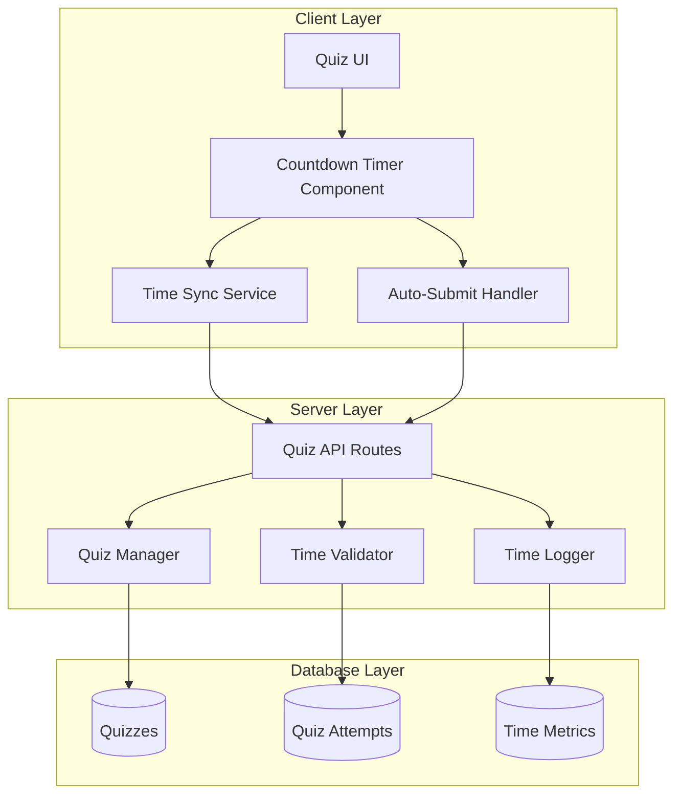
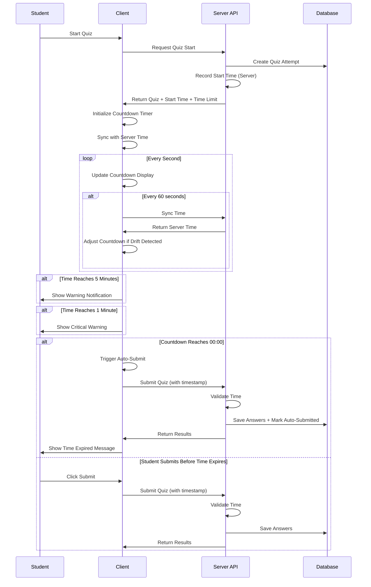

# Design Document

## Overview

This design document outlines the architecture and implementation strategy for adding configurable time limits to quizzes with countdown timer functionality. The solution provides server-authoritative time tracking with client-side countdown display, automatic quiz submission when time expires, and comprehensive time synchronization to prevent manipulation. The design ensures fair time enforcement across all devices while maintaining excellent user experience.

## Architecture

### High-Level Architecture



### Component Interaction Flow



## Components and Interfaces

### 1. Countdown Timer Component

**Purpose**: Display remaining time counting down from time limit to zero.

**Interface**:
```typescript
interface CountdownTimerProps {
  startTime: Date;
  timeLimitMinutes: number;
  onTimeExpired: () => void;
  onWarning: (minutesRemaining: number) => void;
}

interface CountdownTimerState {
  timeRemaining: number; // in seconds
  displayTime: string; // formatted as MM:SS or HH:MM:SS
  status: 'normal' | 'warning' | 'critical';
}
```

**Implementation Details**:
- Update display every second using setInterval
- Calculate time remaining: (startTime + timeLimit) - currentTime
- Format display: MM:SS for < 60 minutes, HH:MM:SS for >= 60 minutes
- Change styling based on time remaining:
  - Normal: > 5 minutes (default color)
  - Warning: <= 5 minutes (yellow/orange)
  - Critical: <= 1 minute (red)
- Trigger callbacks at 5 minutes, 1 minute, and 0:00
- Fixed position at top of quiz interface
- Responsive design for mobile devices

### 2. Time Synchronization Service

**Purpose**: Keep client time synchronized with server time for accurate countdown.

**Interface**:
```typescript
interface TimeSyncService {
  initialize(serverTime: Date): void;
  getCurrentTime(): Date;
  syncWithServer(): Promise<void>;
  getTimeDrift(): number;
  adjustForDrift(drift: number): void;
}

interface TimeSyncConfig {
  syncIntervalSeconds: number; // 60 seconds
  maxDriftThreshold: number; // 5 seconds
}
```

**Implementation Details**:
- Store server time offset on initialization
- Calculate current time: localTime + serverOffset
- Periodic sync every 60 seconds
- Measure round-trip time for latency compensation
- Adjust countdown if drift > 5 seconds detected
- Use UTC timestamps to handle time zones
- Handle network failures gracefully

### 3. Auto-Submit Handler

**Purpose**: Automatically submit quiz when countdown reaches zero.

**Interface**:
```typescript
interface AutoSubmitHandler {
  initialize(onSubmit: () => Promise<void>): void;
  trigger(): void;
  cancel(): void;
  isTriggered(): boolean;
}
```

**Implementation Details**:
- Triggered by countdown timer reaching 00:00
- Collect all current answers
- Mark unanswered questions as incomplete
- Call quiz submission API
- Prevent further answer modifications
- Show time expired notification
- Handle submission errors gracefully
- Retry submission if network fails

### 4. Time Validator (Server-Side)

**Purpose**: Validate quiz submissions against server time to prevent manipulation.

**Interface**:
```typescript
interface TimeValidator {
  validateSubmission(
    attemptId: string,
    submissionTime: Date
  ): ValidationResult;
  
  calculateActualTime(
    startTime: Date,
    endTime: Date
  ): number;
  
  isLateSubmission(
    attemptId: string,
    submissionTime: Date
  ): boolean;
}

interface ValidationResult {
  isValid: boolean;
  isLate: boolean;
  actualTimeSeconds: number;
  reason?: string;
}
```

**Implementation Details**:
- Always use server time for validation
- Calculate: actualTime = submissionTime - startTime
- Compare actualTime with timeLimit
- Accept submissions within 30 seconds grace period
- Flag submissions as late if after time limit
- Reject submissions > 30 seconds late
- Log time discrepancies for security review

### 5. Quiz Manager Extension

**Purpose**: Manage time limit configuration and quiz attempt timing.

**Interface**:
```typescript
interface QuizManager {
  createQuiz(quiz: QuizInput): Promise<Quiz>;
  updateQuiz(quizId: string, updates: QuizUpdate): Promise<Quiz>;
  startQuizAttempt(quizId: string, userId: string): Promise<QuizAttemptStart>;
  getQuizAttempt(attemptId: string): Promise<QuizAttempt>;
}

interface QuizInput {
  title: string;
  questions: Question[];
  timeLimitMinutes?: number; // optional
}

interface QuizAttemptStart {
  attemptId: string;
  quiz: Quiz;
  startTime: Date;
  timeLimitMinutes?: number;
}
```

**Implementation Details**:
- Store time limit in quizzes table
- Validate time limit: 1-480 minutes
- Record start time when attempt created
- Return start time and time limit to client
- Calculate expiration time: startTime + timeLimit

### 6. Time Logger

**Purpose**: Track time metrics for admin reporting and analysis.

**Interface**:
```typescript
interface TimeLogger {
  logAttemptTime(
    attemptId: string,
    actualTimeSeconds: number,
    autoSubmitted: boolean
  ): Promise<void>;
  
  getTimeMetrics(quizId: string): Promise<TimeMetrics>;
  
  getAutoSubmittedAttempts(quizId: string): Promise<QuizAttempt[]>;
}

interface TimeMetrics {
  averageTimeSeconds: number;
  medianTimeSeconds: number;
  timeLimitUtilization: number; // percentage
  autoSubmitRate: number; // percentage
  attemptsOver90Percent: number;
}
```

**Implementation Details**:
- Log actual time taken for each attempt
- Track auto-submit flag
- Calculate aggregate statistics
- Identify attempts using > 90% of time
- Support filtering by auto-submitted status

## Data Models

### Quiz Extension

```typescript
interface Quiz {
  id: string;
  title: string;
  description: string;
  questions: Question[];
  timeLimitMinutes?: number; // NEW: optional time limit
  createdAt: Date;
  updatedAt: Date;
}
```

**Database Schema Addition**:
```sql
ALTER TABLE quizzes
ADD COLUMN time_limit_minutes INTEGER CHECK (time_limit_minutes >= 1 AND time_limit_minutes <= 480);
```

### Quiz Attempt Extension

```typescript
interface QuizAttempt {
  id: string;
  quizId: string;
  userId: string;
  startTime: Date; // NEW: server-recorded start time
  endTime?: Date;
  actualTimeSeconds?: number; // NEW: calculated time taken
  autoSubmitted: boolean; // NEW: flag for auto-submission
  isLate: boolean; // NEW: flag for late submission
  answers: Answer[];
  score?: number;
  createdAt: Date;
  updatedAt: Date;
}
```

**Database Schema Additions**:
```sql
ALTER TABLE quiz_attempts
ADD COLUMN start_time TIMESTAMP WITH TIME ZONE NOT NULL DEFAULT NOW(),
ADD COLUMN actual_time_seconds INTEGER,
ADD COLUMN auto_submitted BOOLEAN DEFAULT FALSE,
ADD COLUMN is_late BOOLEAN DEFAULT FALSE;
```

### Time Metrics Table

```typescript
interface TimeMetric {
  id: string;
  attemptId: string;
  quizId: string;
  userId: string;
  actualTimeSeconds: number;
  timeLimitSeconds: number;
  utilizationPercent: number;
  autoSubmitted: boolean;
  isLate: boolean;
  createdAt: Date;
}
```

**Database Schema**:
```sql
CREATE TABLE time_metrics (
  id UUID PRIMARY KEY DEFAULT gen_random_uuid(),
  attempt_id UUID NOT NULL REFERENCES quiz_attempts(id) ON DELETE CASCADE,
  quiz_id UUID NOT NULL REFERENCES quizzes(id) ON DELETE CASCADE,
  user_id UUID NOT NULL REFERENCES users(id) ON DELETE CASCADE,
  actual_time_seconds INTEGER NOT NULL,
  time_limit_seconds INTEGER,
  utilization_percent DECIMAL(5,2),
  auto_submitted BOOLEAN DEFAULT FALSE,
  is_late BOOLEAN DEFAULT FALSE,
  created_at TIMESTAMP WITH TIME ZONE DEFAULT NOW()
);

CREATE INDEX idx_time_metrics_quiz_id ON time_metrics(quiz_id);
CREATE INDEX idx_time_metrics_auto_submitted ON time_metrics(auto_submitted);
```

## Error Handling

### Client-Side Errors

**Countdown Timer Failures**:
- If timer initialization fails, show error and prevent quiz start
- If timer stops updating, attempt to restart
- If sync fails repeatedly, continue with local time and log warning

**Auto-Submit Failures**:
- Retry submission up to 3 times with exponential backoff
- Queue submission if network unavailable
- Show error message if all retries fail
- Prevent data loss by caching answers locally

**Time Sync Failures**:
- Continue with last known server offset
- Log sync failures for admin review
- Show warning to student if drift is significant
- Attempt re-sync on next interval

### Server-Side Errors

**Time Validation Errors**:
- If start time missing, reject submission with error
- If time limit exceeded significantly, flag for review
- If time calculation fails, log error and accept submission
- Always prioritize student experience over strict enforcement

**Database Errors**:
- Retry failed writes with exponential backoff
- Log errors for admin investigation
- Return graceful error messages to client
- Ensure quiz data is not lost

## Testing Strategy

### Unit Tests

1. **Countdown Timer Component**
   - Test countdown from various time limits
   - Test formatting (MM:SS and HH:MM:SS)
   - Test status changes (normal, warning, critical)
   - Test callback triggers at 5 min, 1 min, 0:00
   - Test display updates every second

2. **Time Synchronization Service**
   - Test server time offset calculation
   - Test drift detection and adjustment
   - Test periodic sync intervals
   - Test latency compensation
   - Test time zone handling

3. **Auto-Submit Handler**
   - Test trigger on countdown expiration
   - Test answer collection
   - Test submission retry logic
   - Test error handling

4. **Time Validator**
   - Test valid submissions
   - Test late submissions (within grace period)
   - Test rejected submissions (beyond grace period)
   - Test time calculation accuracy

### Integration Tests

1. **End-to-End Quiz Flow with Time Limit**
   - Start quiz with time limit
   - Verify countdown displays correctly
   - Submit before time expires
   - Verify time recorded accurately

2. **Auto-Submit Flow**
   - Start quiz with short time limit
   - Wait for countdown to reach 00:00
   - Verify auto-submit triggers
   - Verify answers saved correctly
   - Verify auto-submit flag set

3. **Quiz Resume Flow**
   - Start quiz with time limit
   - Close browser
   - Reopen and resume quiz
   - Verify countdown continues from correct time

4. **Time Manipulation Prevention**
   - Attempt to modify client time
   - Verify server validation rejects manipulation
   - Verify time discrepancies logged

### Mobile-Specific Tests

1. **Mobile Countdown Display**
   - Test fixed position while scrolling
   - Test readability on small screens (320px)
   - Test orientation changes
   - Test on iOS Safari and Android Chrome

2. **Mobile Background/Foreground**
   - Put app in background during quiz
   - Return to foreground
   - Verify countdown updates correctly
   - Verify no time lost

3. **Mobile Sleep/Wake**
   - Let device sleep during quiz
   - Wake device
   - Verify countdown reflects actual time passed
   - Verify auto-submit if time expired during sleep

## Performance Considerations

### Client-Side Performance

- **Timer Efficiency**: Use single setInterval for countdown updates
- **Memory Management**: Clear intervals on component unmount
- **Render Optimization**: Only re-render when display time changes
- **Mobile Battery**: Minimize background processing
- **Network Efficiency**: Batch time sync with other API calls when possible

### Server-Side Performance

- **Query Optimization**: Index start_time and time_limit_minutes columns
- **Caching**: Cache quiz time limits in memory
- **Batch Operations**: Batch time metric writes
- **Database Load**: Use database triggers for time calculations

### Network Performance

- **Sync Frequency**: Balance accuracy with network overhead (60s interval)
- **Payload Size**: Minimize time sync request/response size
- **Compression**: Compress time sync data
- **Offline Handling**: Queue operations when offline

## Security Considerations

### Time Manipulation Prevention

- **Server Authority**: Always use server time for validation
- **Timestamp Verification**: Verify all timestamps are reasonable
- **Drift Monitoring**: Log significant time drifts for review
- **Grace Period Limits**: Strict 30-second grace period maximum

### Data Integrity

- **Atomic Operations**: Use database transactions for time-sensitive operations
- **Audit Trail**: Log all time-related events
- **Tamper Detection**: Detect and log client-side manipulation attempts
- **Backup Timestamps**: Store multiple timestamps for verification

### Privacy Considerations

- **Data Minimization**: Only store necessary time data
- **Anonymization**: Remove PII from time metrics where possible
- **Retention Policy**: Auto-delete old time metrics
- **Transparency**: Inform students about time tracking

## Mobile vs Desktop Considerations

| Feature | Desktop | Mobile | Notes |
|---------|---------|--------|-------|
| Countdown Display | Top bar | Fixed top bar | Mobile stays visible while scrolling |
| Timer Updates | Every 1s | Every 1s | Same frequency |
| Time Sync | Every 60s | Every 60s | Same frequency |
| Auto-Submit | Yes | Yes | Same behavior |
| Warnings | Desktop notifications | Mobile-friendly alerts | Adapted for screen size |
| Background Handling | Tab visibility | App background/foreground | Different event handling |
| Sleep Handling | N/A | Device sleep/wake | Mobile-specific |

## Implementation Phases

### Phase 1: Database Schema and Backend API
- Add time_limit_minutes column to quizzes table
- Add time tracking columns to quiz_attempts table
- Create time_metrics table
- Implement time validation service
- Create API endpoints for time sync

### Phase 2: Countdown Timer Component
- Create countdown timer React component
- Implement time formatting logic
- Add status-based styling
- Implement callback system
- Make responsive for mobile

### Phase 3: Time Synchronization
- Implement time sync service
- Add periodic sync mechanism
- Implement drift detection and adjustment
- Handle network failures

### Phase 4: Auto-Submit Functionality
- Implement auto-submit handler
- Add retry logic
- Implement local answer caching
- Add time expired notifications

### Phase 5: Admin Configuration
- Add time limit field to quiz creation form
- Add time limit field to quiz edit form
- Implement validation
- Update quiz display to show time limit

### Phase 6: Admin Reporting
- Display actual time taken in results
- Show auto-submit indicator
- Implement time metrics dashboard
- Add filtering for auto-submitted attempts

### Phase 7: Testing and Refinement
- Comprehensive testing across devices
- Performance optimization
- User acceptance testing
- Bug fixes and refinements

## Monitoring and Analytics

### Metrics to Track

1. **Time Limit Usage**
   - Percentage of quizzes with time limits
   - Distribution of time limit values
   - Average time limit by quiz type

2. **Completion Metrics**
   - Average time taken vs time limit
   - Time limit utilization percentage
   - Auto-submit rate
   - Late submission rate

3. **Performance Metrics**
   - Time sync latency
   - Time drift frequency and magnitude
   - Auto-submit success rate
   - Client-side timer accuracy

4. **User Experience**
   - Quiz completion rate (timed vs untimed)
   - Student feedback on time limits
   - Admin satisfaction with time enforcement

### Alerting

- Alert on high auto-submit rates (> 20%)
- Alert on frequent time sync failures
- Alert on significant time drift patterns
- Alert on time validation rejections
- Alert on auto-submit failures

## Future Enhancements

1. **Flexible Time Extensions**
   - Allow admins to grant time extensions
   - Support accessibility accommodations
   - Implement pause functionality for emergencies

2. **Time Limit Templates**
   - Predefined time limits by quiz type
   - Recommended time limits based on question count
   - Time limit suggestions based on historical data

3. **Advanced Analytics**
   - Time spent per question
   - Correlation between time taken and score
   - Identify questions that take longest
   - Optimize time limits based on data

4. **Student Time Management**
   - Show time spent per question
   - Provide pacing suggestions
   - Alert if spending too long on one question
   - Time management tips and guidance
